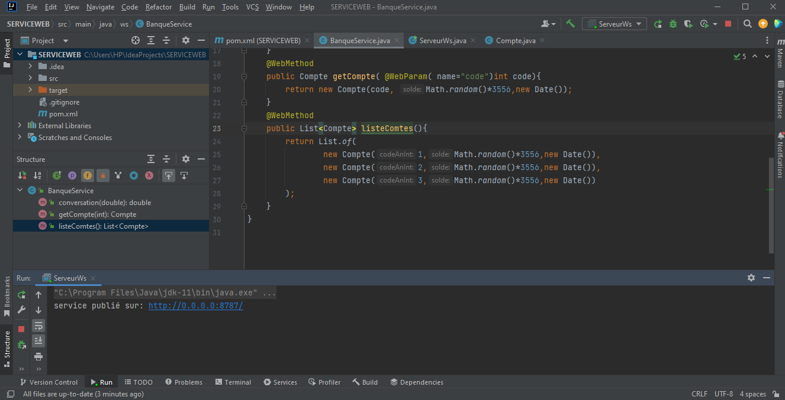
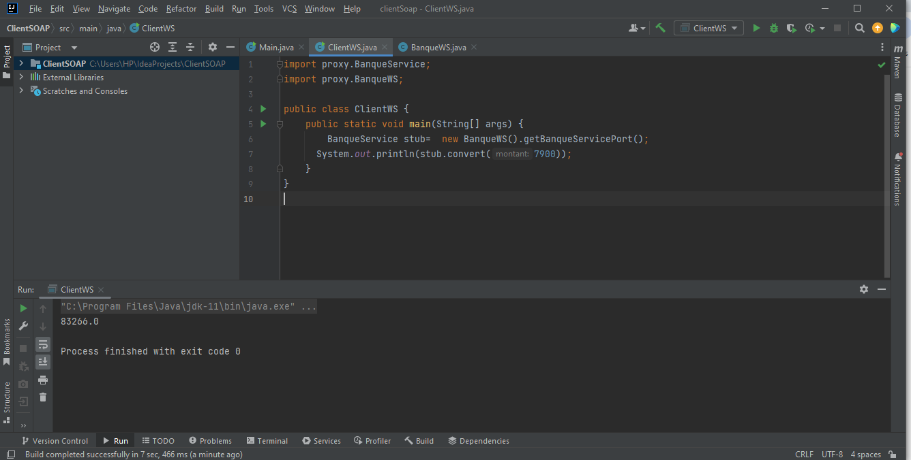

# Web Service SOAP avec WSDL et Client

Une démonstration d'un Web Service SOAP créé avec WSDL, accompagné d'un client pour consommer ce service. Ce projet illustre l'utilisation de technologies SOAP pour la communication entre applications distribuées.

